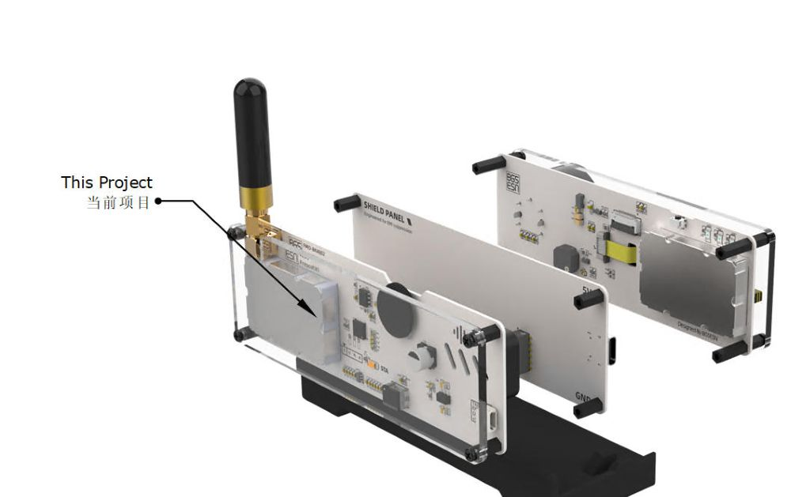
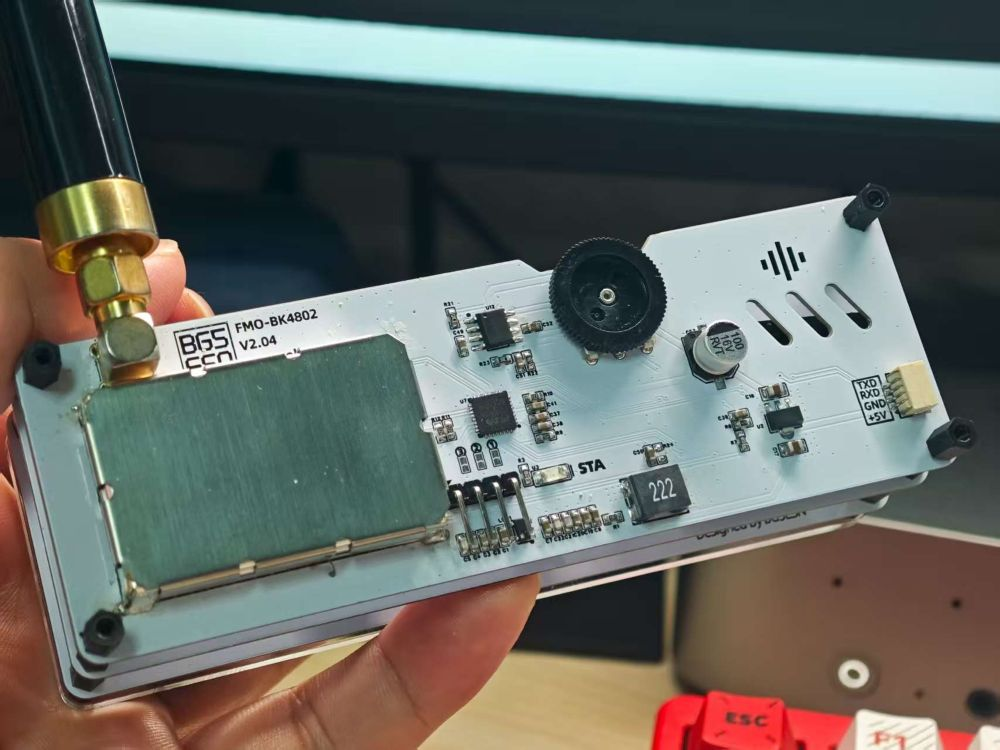
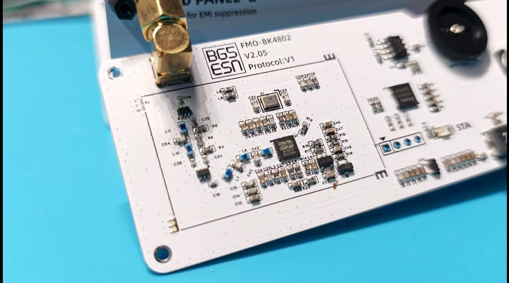

[English Version](README_en.md)
---
# FMO 开源背板 V2.00
本项目是FMO(NFM Over Internet)的背板开源软件项目部分。FMO是服务于业余无线电爱好者们的下一代模拟FM电台中继互联网硬件。

它利用APRS-IS发现爱好者们自己搭建的语音服务器。爱好者们可以使用模拟手台在FMO上使用模拟手台互相通联，期间不依赖厂家的任何服务。

具体可访问BG5ESN.com获取更多资料、材料。







硬件请前往：https://oshwhub.com/xifengzui/works 查看相关信息

## 项目概述

该项目为FMO的附属项目。这是NFM（窄带调频）无线通信模块，采用PY32F030x8微控制器和BK4802无线收发芯片，通过UART接口使用AT指令进行控制和配置。

## 硬件架构

### 主控芯片
- **型号**: PY32F030x8（普冉半导体）

### 无线芯片
- **型号**: BK4802

## 软件架构

### 开发环境
- **IDE**: Keil uVision
- **调试工具**: CMSIS-DAP

### 软件框架
```
应用层 (Application)
    ├── AT指令处理
    ├── 无线通信控制
    └── 用户界面管理
    │
驱动层 (Driver)
    ├── BK4802无线驱动
    ├── 调度器 (SCH51)
    ├── 日志系统 (EasyLogger)
    └── 基础组件库
    │
硬件抽象层 (HAL)
CMSIS层

```

### 任务调度
由于硬件性能限制，目前我们使用了经典的SCH51时间触发调度器，让其支持多任务协作

## 功能特性

### 频率支持
- **144-146MHz**: 业余无线电2米波段
- **430-440MHz**: 业余无线电70厘米波段
- 支持其他频段配置

### 控制功能
- **频率设置**: 可独立设置发射和接收频率
- **音量控制**: 0-10级音量调节
- **静噪控制**: 0-10级静噪电平
- **功率控制**: 低、中、高三级发射功率
- **频率微调**: ±100Hz频率校准
- **信号强度**: S-meter信号强度指示（1-9级）

### AT指令集
具体可以查看代码或访问BG5ESN.com

## 项目结构

```
nfm-module-opensource/
├── CMSIS/
├── components/           # 功能组件
├── device/              # 设备驱动
├── hal/                 # 硬件抽象层
├── project/             # 项目文件
└── user/                # 用户应用代码
    ├── at.c/.h          # AT指令处理
    ├── atCommand.c/.h   # AT命令解析
    ├── BK4802.c/.h      # 无线芯片驱动
    ├── radio.c/.h       # 无线功能封装
    ├── antennaPath.c/.h # 天线路径控制（控制过衰减路径还是滤波路径）
    ├── led.c/.h         # LED控制
    ├── speaker.c/.h     # 音频输出
    ├── jumper.c/.h      # 跳线设置（用于控制程序的默认行为）
    ├── misc.c/.h        # 杂项功能
    ├── main.c/.h        # 主程序
```

## 开发环境配置

### 所需工具
1. **Keil uVision**: MDK-ARM开发环境
2. **PY32F0xx_DFP**: 普冉半导体设备支持包
3. **CMSIS-DAP**: 调试编程器

### 编译步骤
1. MDK 打开 `project/nfm-module.uvprojx` 项目文件
2. 确保已安装PY32F0xx设备支持包
3. 编译项目（F7）
4. 使用CMSIS-DAP下载程序到目标板
5. 如需调试,需使用CMSIS-DAP兼容的RTT调试设备(如H7-Tool)

## 许可证

本项目采用MIT许可证，详见项目根目录下的LICENSE文件。

## 贡献指南

欢迎提交Issue和Pull Request来改进本项目。请确保代码风格与现有代码保持一致。

## 版本历史

- **v2.00** (2024-10-21)
硬件改动-增加LPF 以解决 BK4802的谐波问题。
通过软件进行SQL\音量设置，去除无关硬件设计。

## 特别鸣谢

# BI1AFE


