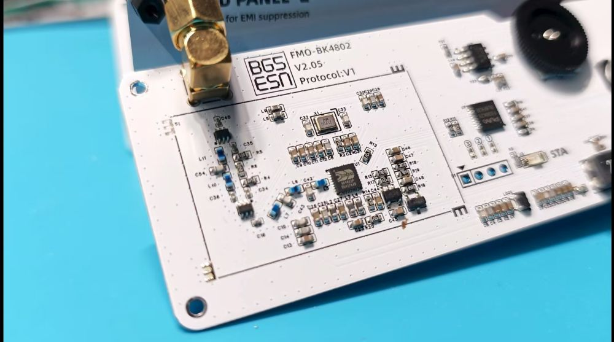

[中文版本](README.md)
--- 
# FMO Open Source Backplane V2.00
This project is the open source software part of the FMO (NFM Over Internet) backplane. FMO is the next-generation analog FM radio repeater internet hardware serving amateur radio enthusiasts.

It utilizes APRS-IS to discover voice servers set up by enthusiasts themselves. Enthusiasts can use analog handheld radios to communicate with each other on FMO, without relying on any manufacturer services.

For more information and materials, please visit BG5ESN.com.




For hardware information, please visit: https://oshwhub.com/xifengzui/works

## Project Overview

This project is an affiliated project of FMO. It is an NFM (Narrowband FM) wireless communication module using PY32F030x8 microcontroller and BK4802 wireless transceiver chip, controlled and configured via UART interface using AT commands.

## Hardware Architecture

### Main Control Chip
- **Model**: PY32F030x8 (Puya Semiconductor)

### Wireless Chip
- **Model**: BK4802

## Software Architecture

### Development Environment
- **IDE**: Keil uVision
- **Debugging Tool**: CMSIS-DAP

### Software Framework
```
Application Layer
    ├── AT Command Processing
    ├── Wireless Communication Control
    └── User Interface Management
    │
Driver Layer
    ├── BK4802 Wireless Driver
    ├── Scheduler (SCH51)
    ├── Logging System (EasyLogger)
    └── Basic Component Library
    │
Hardware Abstraction Layer (HAL)
CMSIS Layer

```

### Task Scheduling
Due to hardware performance limitations, we currently use the classic SCH51 time-triggered scheduler to support multi-task cooperation.

## Features

### Frequency Support
- **144-146MHz**: Amateur radio 2-meter band
- **430-440MHz**: Amateur radio 70-centimeter band
- Supports configuration for other frequency bands

### Control Functions
- **Frequency Setting**: Independent transmit and receive frequency settings
- **Volume Control**: 0-10 level volume adjustment
- **Squelch Control**: 0-10 level squelch threshold
- **Power Control**: Low, Medium, High three-level transmit power
- **Frequency Fine-tuning**: ±100Hz frequency calibration
- **Signal Strength**: S-meter signal strength indication (1-9 levels)

### AT Command Set
For details, please check the code or visit BG5ESN.com

## Project Structure

```
nfm-module-opensource/
├── CMSIS/
├── components/           # Functional components
├── device/              # Device drivers
├── hal/                 # Hardware Abstraction Layer
├── project/             # Project files
└── user/                # User application code
    ├── at.c/.h          # AT command processing
    ├── atCommand.c/.h   # AT command parsing
    ├── BK4802.c/.h      # Wireless chip driver
    ├── radio.c/.h       # Wireless function encapsulation
    ├── antennaPath.c/.h # Antenna path control (controlling attenuation path or filter path)
    ├── led.c/.h         # LED control
    ├── speaker.c/.h     # Audio output
    ├── jumper.c/.h      # Jumper settings (for controlling program default behavior)
    ├── misc.c/.h        # Miscellaneous functions
    ├── main.c/.h        # Main program
```

## Development Environment Setup

### Required Tools
1. **Keil uVision**: MDK-ARM development environment
2. **PY32F0xx_DFP**: Puya Semiconductor device support package
3. **CMSIS-DAP**: Debug programmer

### Compilation Steps
1. Open `project/nfm-module.uvprojx` project file in MDK
2. Ensure PY32F0xx device support package is installed
3. Compile the project (F7)
4. Download program to target board using CMSIS-DAP
5. For debugging, use CMSIS-DAP compatible RTT debugging device (such as H7-Tool)

## License

This project uses the MIT license. For details, please see the LICENSE file in the project root directory.

## Contribution Guidelines

Welcome to submit Issues and Pull Requests to improve this project. Please ensure the code style is consistent with existing code.

## Version History

- **v2.00**

2025/09/17

Hardware changes - added LPF to solve BK4802 harmonic issues.
Software-based SQL/volume settings, removed irrelevant hardware designs.

## Special Thanks

# BI1AFE

---


