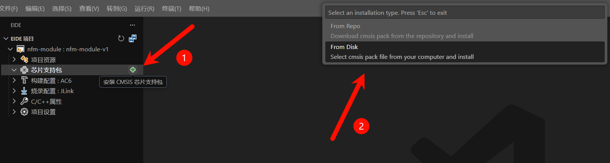
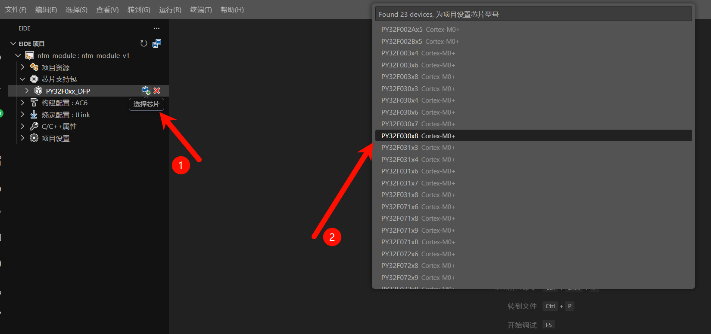

# FMO开源背板 使用 VSCODE 进行编程调试瞎逼逼

## VS Code编程调试方案

推荐采用方案1，但我不用🐶

### 方案1：纯ARM-GCC编程

[模板库链接](https://github.com/IOsetting/py32f0-template)

- 使用以上模板库对代码进行移植，这里不过多赘述。详细教程可以参考以下链接：

[普冉PY32系列(二) Ubuntu GCC Toolchain和VSCode开发环境 - Milton - 博客园](https://www.cnblogs.com/milton/p/17051966.html)

### 方案2：采用EIDE插件移植

#### 前期准备

1. [VS Code](https://code.visualstudio.com/)
2. 一台Windows电脑（别问我为什么不能是苹果和LINUX，__因为我没有__）

#### 安装阶段

请根据实际情况调整任务起点

1. 安装VS Code
2. 安装[EIDE插件](https://marketplace.visualstudio.com/items?itemName=CL.eide)
3. 依次打开`操作`-`安装实用工具`

4. 安装__破解版AC5和AC6__以及__必要的其他工具__

5. 安装完毕后按照提示重启VS Code

   

6. 依次选择`导入项目`-`MDK`-`ARM`

7. 找到并打开MDK工程(`/project/nfm-module.uvprojx`)

8. 依次选择`安装CMSIS芯片支持包`-`From Disk`,并在弹出的文件资源管理器页面找到芯片支持包(`/docs/Puya.PY32F0xx_DFP.1.1.7.pack`)

   

9. 依次选择`选择芯片`-`PY32F030x8`

10. 开始使用

## 附录

### 使用J-Link烧录&调试

请参考[此链接](https://py32.org/tool/PY32_JFlash_Plugin.html#介绍)

---
更新时间：2025年12月8日 11点12分